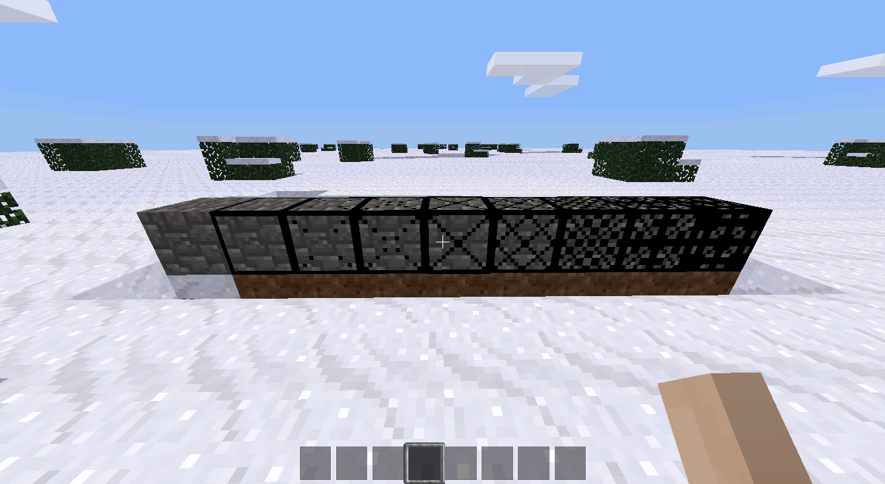

# mt\_compressed\_blocks
A minetest mod to create craftable compressed versions of nodes

This mod allows you to register nodes to have "compressed" versions of those nodes created.
It should be noted that by default, only one compressed block is registered:
cobblestone, because I'm always filling my inventory with the damned stuff.

The compressed nodes are intended to be crafted from the uncompressed form (with reverse recipes).
Currently these recipes are 8 of the uncompressed form creates one compressed node.
The compressed nodes can be further compressed again, up to a definable limit.
This makes the compressed nodes a very useful tool to save space.

Features:

* Compression depth limit can be configured at registration time.
Currently limited to 8 only due to textures used for overlaying the base node's textures.

* Automated - most information about the blocks is read from the base node's registered information,
unlike some mods which hardcode everything.

* Texture overlaying - again unlike some compression mods, this mod uses an overlay texture
This means that new compressed blocks can be added trivally and that the texture pack's tiles for that node will be used as the base texture.

Current areas in need of improvement:

* Textures. I'm a programmer, I can't draw for jack.
The current textures are somewhat inspired by mods from the other block game with the same ideas as this one.

* Block groups - as these are used for more than just tool resistance when mining,
there is not yet a mechanism to produce suitable block groups with increasing "hardness",
so every compressed block behaves like a hard stone-like block.

* Block sounds - this should be a bit easier to do, just not done yet.
Again currently all compressed blocks sounds like stone, too.

* A mechanism to replace the default craft registration to allow more realistic difficulty when compressing blocks.
It is envisioned that technic's compressors could be used, requiring the player to advance somewhat before they can start über-compressing blocks.

All code and crappy textures are released into the public domain -
this means you can do *anything* you like with it without any legal worries. Be free!
See the LICENSE file for details.

Current TODO:

* API documentation, though there's not much of it.

Screenshots

More coming soon when there's more to look at.